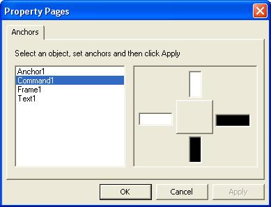

## Automatic Control Resizer

### Description

Need Anchor Control, I've updated my code and You can find it here: Advanced Control Resizer & Positioner -> http://www.planetsourcecode.com/vb/scripts/ShowCode.asp?txtCodeId=53861&lngWId=1
 
### More Info
 

             |
---                |---
**Submitted On**   |2003-11-27 18:57:06
**By**             |[Hamed Oveisi](https://github.com/Planet-Source-Code/PSCIndex/blob/master/ByAuthor/hamed-oveisi.md)
**Level**          |Intermediate
**User Rating**    |4.9 (68 globes from 14 users)
**Compatibility**  |VB 5\.0, VB 6\.0, VBA MS Access, VBA MS Excel
**Category**       |[OLE/ COM/ DCOM/ Active\-X](https://github.com/Planet-Source-Code/PSCIndex/blob/master/ByCategory/ole-com-dcom-active-x__1-29.md)
**World**          |[Visual Basic](https://github.com/Planet-Source-Code/PSCIndex/blob/master/ByWorld/visual-basic.md)
**Archive File**   |[Automatic\_16768011272003\.zip](https://github.com/Planet-Source-Code/hamed-oveisi-automatic-control-resizer__1-50146/archive/master.zip)

